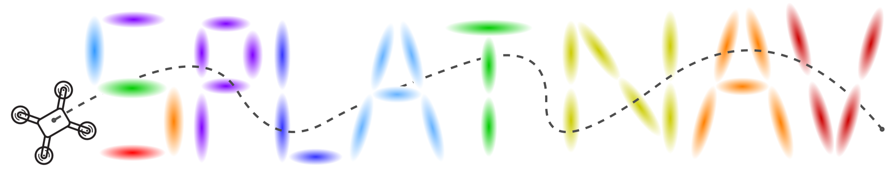
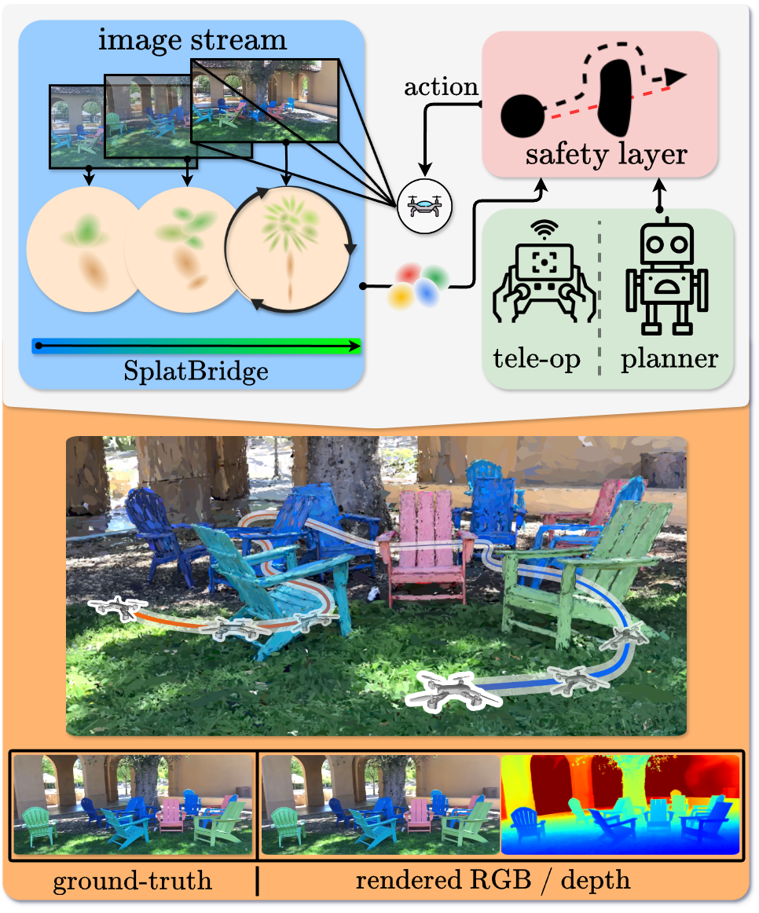

<p align="center">

  <h1 align="center"></h1>
  <h2 align="center">Safe Real-Time Robot Navigation in
Gaussian Splatting Maps</h2>
  <p align="center"> 
    <a href="https://msl.stanford.edu/people/timchen"><strong>Timothy Chen</strong><sup>1</sup></a>
    ·
    <a href="https://msl.stanford.edu/people/olashorinwa"><strong>Ola Shorinwa</strong><sup>1</sup></a>
    ·
    <a href="https://www.joseph-bruno.com/"><strong>Joseph Bruno</strong><sup>3</sup></a>
    ·
    <a href="https://aidenswann.com/"><strong>Aiden Swann</strong><sup>1</sup></a>
    ·
    <a href="https://msl.stanford.edu/people/javieryu"><strong>Javier Yu</strong><sup>1</sup></a>
    ·
    <a href="https://x.com/WeijiaZeng1"><strong>Weijia Zeng</strong><sup>2</sup></a>
    ·
    <a href="https://msl.stanford.edu/people/keikonagami"><strong>Keiko Nagami</strong><sup>1</sup></a>
    ·
    <a href="https://engineering.temple.edu/directory/philip-dames-tug85627"><strong>Philip Dames</strong><sup>3</sup></a>
    ·
    <a href="https://web.stanford.edu/~schwager/"><strong>Mac Schwager</strong><sup>1</sup></a>
  </p>
  <p align="center"><strong><sup>1</sup>Stanford University</strong></p>
  <p align="center"><strong><sup>2</sup>UC San Diego</strong></p>
  <p align="center"><strong><sup>3</sup>Temple University</strong></p>
  <!-- <h2 align="center">Submitted TR-O 2025</h2> -->
  <h3 align="center"><a href="https://chengine.github.io/splatnav"> Project Page</a> | <a href= "https://arxiv.org/abs/2403.02751">arXiv</a> | <a href="https://drive.google.com/drive/folders/1K0zfpuAti43YIBK5APFd-Yv73CvljgMC?usp=sharing">Data</a></h3>
  <div align="center"></div>
</p>
<p align="center">
  <a href="">
    <!--  -->
  </a>
</p>
<h3 align="center">
Splat-Nav is a real-time navigation pipeline designed to work with environment representations generated by Gaussian Splatting (GSplat), a powerful new 3D scene representation. 
Splat-Nav consists of two components: Splat-Plan, a safe planning module, and Splat-Loc, a robust pose estimation module.
</h3>

## About
Splat-Plan builds a safe-by-construction polytope corridor through the map based on mathematically rigorous collision constraints and then constructs a Bezier curve trajectory through this corridor. Splat-Loc provides a robust state estimation module, leveraging the point-cloud representation inherent in GSplat scenes for recursive real-time pose localization, given only RGB images. The most compute-intensive procedures in our navigation pipeline, such as the computation of the Bezier trajectories and the pose optimization problem run primarily on the CPU, freeing up GPU resources for GPU-intensive tasks, such as online training of Gaussian Splats. We demonstrate the safety and robustness of our pipeline in both simulation and hardware experiments, where we show online re-planning at greater than 5 Hz and pose estimation at about 25 Hz, an order of magnitude faster than Neural Radiance Field (NeRF)-based navigation methods, thereby enabling real-time navigation. 

## ROS Nodes
This branch is where you would run the associated ROS nodes with Splat-Nav (i.e. Splat-Plan and Splat-Loc). 

## Dependencies
Make sure that you can run the simulation code on your dataset and GSplat model in the `main` branch. Therefore, you need to have all the dependencies installed from that branch first. This codebase runs on ROS 2.

Splat-Plan always requires a pose source to run in order for it to plan from an initial position. This pose can come externally from VIO/SLAM or from Splat-Loc. 

If you want to specify goal locations through text, you will need to train your model differently from `splatfacto`. Please look at the `semantics` branch of this repository to train your semantic GSplat. 

## Datasets
Your data format should be the same as in the `main` branch. 

## Running Splat-Nav

### Splat-Loc
Similarly, run
```
python splat_loc_node.py
```
to execute Splat-Loc on the trained scene. There is a strong assumption that the camera used to train the GSplat is the same one that is streamed to Splat-Loc at test time. While our method can handle different train/test cameras, this functionality is not implemented. As a sanity check, it is HIGHLY advised that users run Splat-Loc and Splat-Plan (do NOT press anything after running Splat-Plan, we only run Splat-Plan to visualize the point cloud. Alternatively, you can set the `/control` topic to something that's not being used) and see if the Splat-Loc pose matches with the scene. If you are also running VIO/SLAM, it would also be advised to check the two estimates and verify that they are somewhat close to each other.

### Splat-Plan
After the dependencies, data, and model is set up, run
```
python run_ros.py
```
to execute Splat-Plan. 

Ensure that the pose source in `run_ros` points to your correct pose topic. You need to manually set the pose source (`external` for VIO/SLAM and `splat-loc` for Splat-Loc) in the header. Also, the topic names (especially your VIO/SLAM pose) needs to be changed to match your setup. If you are using `external`, make sure the pose message is a PoseStamped message.

Ensure the mode is properly set in the header. `open-loop` only takes in the initial position once and plans once. `closed-loop` continually replans until it has reached the goal, ingesting in the pose source to set the new initial pose. 

In order to set the goal location, you have the option of doing this manually or through a text query. For manual entry, you can hard-code this into the variable GOALS. If you want specification through text (e.g. `beachball`), you will need to have a trained model using a semantic GSplat (see dependencies). 

At 10 Hz, the node publishes waypoints from the trajectory in the form of Float32MultiArray under the topic `/control`.

Please parse the `run_ros` code to see if it makes sense for your setup. There are additional parameters that you will need to set within the script to match your setup. We are in no way liable for injury / damage if you choose to use this codebase.

### Visualizing
The nodes publish the VIO/SLAM poses (PoseStamped, `/vio_pose`), PoseStamped Splat-Loc poses (if you are running Splat-Plan, `/current_pose`), the goal (PoseStamped, `/goal_pose`), the planned trajectory (PoseArray, `/trajectory`), and the GSplat point cloud (PointCloud2, `/gsplat_pcd`). You can visualize these topics through RVIZ. 

## Citation
If you found Splat-Nav useful, consider citing us! Thanks!
```
@misc{chen2024splatnav,
      title={Splat-Nav: Safe Real-Time Robot Navigation in Gaussian Splatting Maps}, 
      author={Timothy Chen and Ola Shorinwa and Joseph Bruno and Aiden Swann and Javier Yu and Weijia Zeng and Keiko Nagami and Philip Dames and Mac Schwager},
      year={2024},
      eprint={2403.02751},
      archivePrefix={arXiv},
      primaryClass={cs.RO},
      url={https://arxiv.org/abs/2403.02751}, 
}
```
